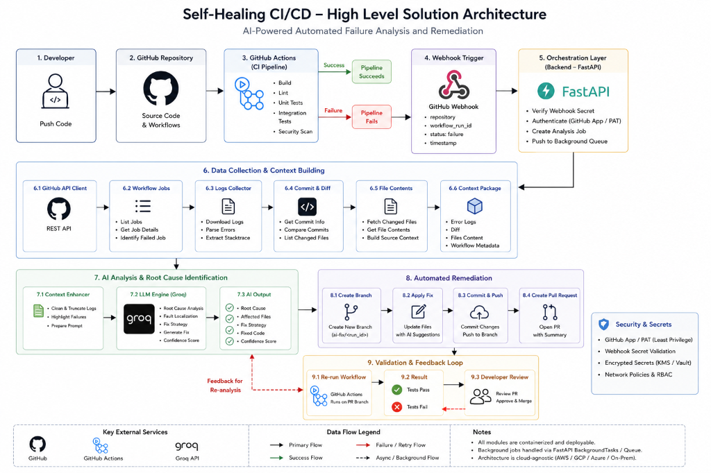
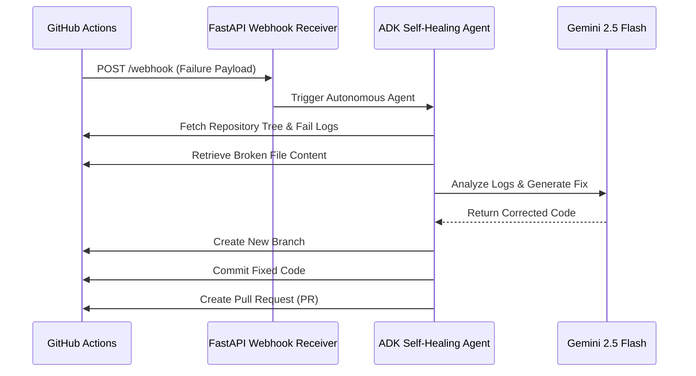

# Self-Healing CI/CD Webhook Receiver (Backend)



An automated backend service that receives GitHub Actions failure webhooks and triggers an autonomous AI agent to diagnose, fix, and open a Pull Request for pipeline failures.

This project is built using **FastAPI** and the **Google ADK (Agent Development Kit)** to facilitate self-healing software development lifecycles.

---

## 🚀 How It Works



1. **Failure Notification**: A GitHub Actions workflow fails, sending a POST request to the `/webhook` endpoint with details of the failure (repo, run ID, head SHA).
2. **Authentication**: The webhook is verified against a configured `WEBHOOK_SECRET` token.
3. **Log Extraction**: The server retrieves the runner logs for the failed job from GitHub.
4. **Agent Execution**: An autonomous ADK agent takes over:
   - Lists the repository files.
   - Parses the failed logs to locate the failing file.
   - Fetches the source code and any necessary dependencies.
   - Prompting Gemini to write a precise, context-aware fix.
5. **Auto-Remediation**: The agent creates a new git branch, commits the fix, and opens a Pull Request on GitHub detailing the failure and solution.

---

## 🛠️ Tech Stack

- **Framework**: [FastAPI](https://fastapi.tiangolo.com/)
- **ASGI Server**: [Uvicorn](https://www.uvicorn.org/)
- **Agent SDK**: [Google ADK (Agent Development Kit)](https://github.com/google/adk)
- **AI Model**: `gemini-2.5-flash`
- **HTTP Client**: [HTTPX](https://www.python-httpx.org/)

---

## ⚙️ Configuration & Environment Variables

Create a `.env` file in the `backend/` directory with the following keys:

```env
# GitHub Personal Access Token (PAT) with 'repo' scope
GITHUB_TOKEN=your_github_personal_access_token

# Secret token to authorize incoming webhooks
WEBHOOK_SECRET=your_secure_webhook_secret
```

---

## 🏃 Getting Started

### 1. Prerequisites
- Python 3.10+
- A GitHub Personal Access Token (PAT) with repo write access.

### 2. Installation
Set up a Python virtual environment and install the dependencies:
```bash
# Navigate to the backend directory
cd backend

# Create and activate virtual environment
python -m venv venv
source venv/bin/activate  # On Windows use `venv\Scripts\activate`

# Install dependencies
pip install -r requirements.txt
```

### 3. Running the Server Locally
Start the FastAPI server:
```bash
uvicorn main:app --reload
```
By default, the server runs on `http://127.0.0.1:8000`.

### 4. API Endpoints
- **`GET /health`**: Health check endpoint.
- **`POST /webhook`**: Receives GitHub Action failure events.
  - Headers: `Authorization: Bearer <WEBHOOK_SECRET>`
  - Payload Format:
    ```json
    {
      "repo": "owner/repo-name",
      "run_id": "1234567890",
      "branch": "main",
      "head_sha": "commit_hash_here",
      "logs": "Optional runner logs to process"
    }
    ```
